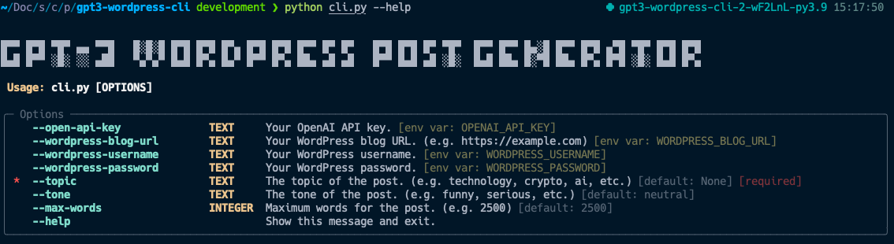

# GPT3 WordPress Post Generator
This is a simple script I use to create posts for [NoHumansWrite](https://nohumanswrite.com) blog. It uses 
the OpenAI GPT-3 API to generate a WordPress post starting from the topic and tone 
of what you want to write.



It uses the [OpenAI Python library](https://github.com/openai/openai-python) to make the OpenAI api calls and the 
[WordPress XML-RPC library](https://github.com/maxcutler/python-wordpress-xmlrpc) to create WordPress posts.

At the moment this is a very rough implementation. I'm looking to improve it in the future and add more options to 
the script. Feel free to contribute if you find it useful.

## Installation
1. Clone the repository
2. Install the requirements: `poetry install`
3. Export the following variables:

    ```bash
    export OPENAI_API_KEY="Your OpenAI API Key"
    export WORDPRESS_URL="Your WordPress xmlrpc URL"
    export WORDPRESS_USERNAME="Your WordPress username"
    export WORDPRESS_PASSWORD="Your WordPress password"
    ```
4. Run the script: `poetry run python cli.py --help`
5. Enjoy!

## Known Limitations
- WordPress post won't be created using blocks, it will be created using the classic editor. To convert it to blocks,
  you can go to the post and click on the "Convert to blocks" button.